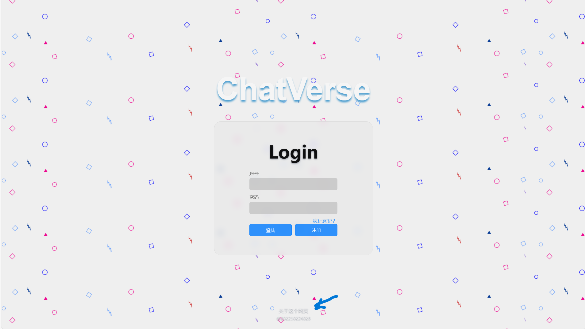
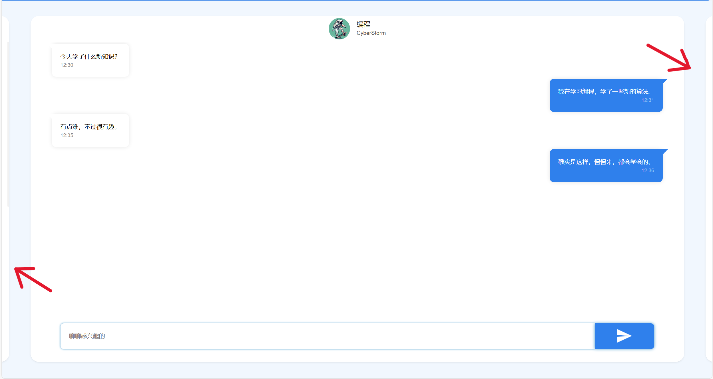

# Web_Design
Chat_&amp;_Play_&amp;_Review

## 功能介绍

### 1.登陆页面 

> - 可以存储密码账户，同时支持密码找回
> - 可以注册密码，同时会检查账号是否重复。以及在注册时可以确保账号是新的
> - 有页脚的网页介绍
> - 

### 2.聊天页面介绍

> - 点击聊天卡片的边缘可以进行卡片的轮播
> - 同时可以发送信息
> - 同时图片浏览页面也可以进行卡片轮播
> > - 

## 参考文档及项目
[登陆页面](https://github.com/codeacg/HTML-CSS/blob/main/01-%E7%AE%80%E5%8D%95%E7%99%BB%E9%99%86%E7%95%8C%E9%9D%A2/index.html)

[聊天页面](https://blog.csdn.net/lutrra/article/details/120390780)
[聊天页面](https://blog.csdn.net/k_06140/article/details/125566198)

[轮播卡片](https://juejin.cn/post/6844903939159277576?from=search-suggest)

[源码](https://github.com/orangleLi/my-swiper)

[蓝色页面模板](http://demo.sucaihuo.com/modals/65/6567/demo/)